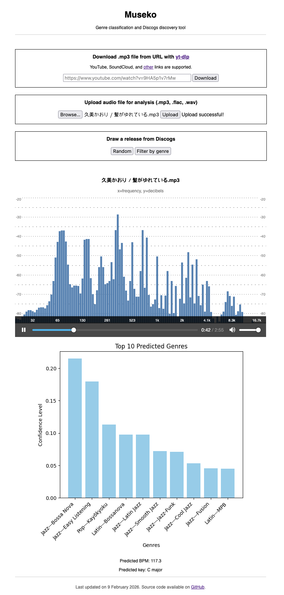

## Museko: genre classification and Discogs release discovery tool for macOS

Note: Essentia does not have Python bindings for Windows.

Some features of this tool:

- Audio visualization with [audioMotion-analyzer](https://audiomotion.dev/#/)
- Genre classification with audio models from Essentia referencing the Discogs style taxonomy ([genre_discogs400](https://essentia.upf.edu/models.html))
- Download .mp3 files from supported sites with yt-dlp interface
- Discogs release roulette (with limited genre filtering)





## Usage
This tool requires too much memory to be hosted online using free services.
The only way to try out this app would be to run it locally.


## Instructions

1. Download `museko.zip` in [Releases](https://github.com/bmai1/museko/releases) and unzip.
3. Install Python dependencies. `essentia-tensorflow` may require `tensorflow` to be installed. It is recommended to use a virtual environment:
```bash
cd path/to/museko
python3 -m venv env
. env/bin/activate
```
```bash
pip3 install -r requirements.txt
```
3. Run Flask development server, which defaults to http://127.0.0.1:5000 and can be viewed in a web browser.
```
flask run
```

4. Upload mp3 files that you wish to analyze. After a few seconds, it will display the genre prediction graph and audio visualizer.

5. ```Ctrl-C``` in the command line to close the server when you are done.