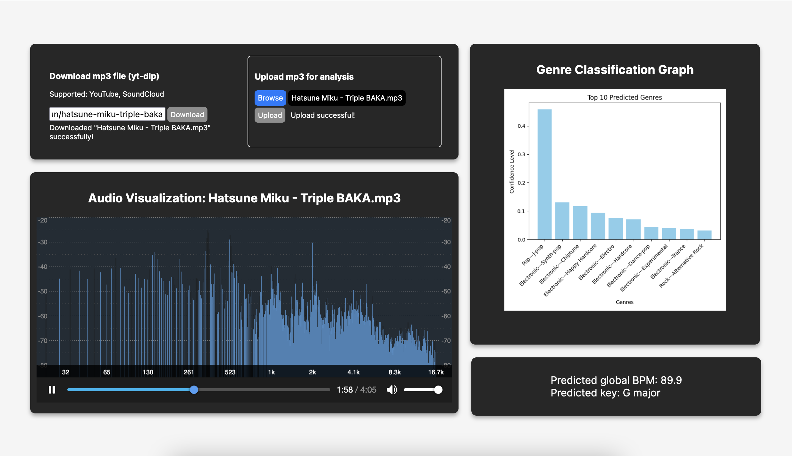
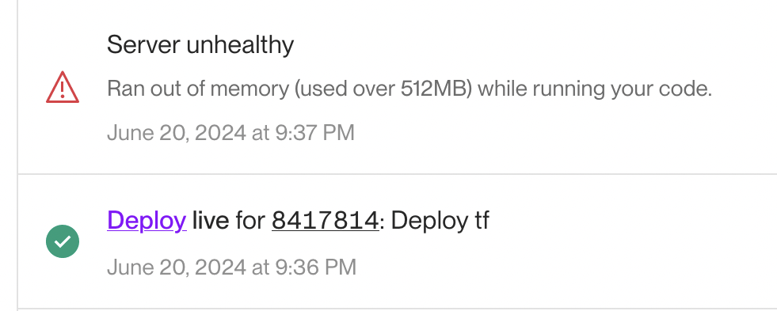

## What is Museko?

*(Not supported for Windows as Essentia, the audio classification library used in this project, currently only has Python bindings for macOS and Linux)*

Museko is a music analysis tool that I'm making multiple versions of for some reason (I suck at developing stuff).
Some features include:

- Music style classification with Essentia from the Discogs taxonomy ([EffNet CNN: genre_discogs400](https://essentia.upf.edu/models.html))
- yt-dlp GUI to download mp3s from [supported sites](https://github.com/yt-dlp/yt-dlp/blob/master/supportedsites.md)
- Real-time audio visualization with [audioMotion-analyzer ](https://audiomotion.dev/#/)
- Additional song details
- (Not yet implemented) music roulette because gambling addiction

Here is the Flask web app view:




## Usage
Unfortunately, this tool requires too much memory to be hosted online using free services.
The only way to try out this app would be running it locally. There is a basic tkinter window that is quick and easy to use, or the web app can be run on a browser with flask.



## Instructions

1. Download `museko.zip` in [Releases](https://github.com/bmai1/museko/releases). It is not recommended to clone this whole repo because it contains too much random stuff.
3. Install Python dependencies. It is recommended to use a virtual environment:
```bash
cd path/to/museko
python3 -m venv env
. env/bin/activate
```
```bash
pip3 install -r requirements.txt
```
3. Run Flask development server, which defaults to http://127.0.0.1:5000 and can be viewed in a web browser.
```
flask run
```

4. Upload mp3 files that you wish to analyze. After a few seconds, it will display the genre prediction graph and audio visualizer.

5. ```Ctrl-C``` in the command line to close the server when you are done.

## Alternatively
There is a tkinter GUI (museko.py) located in the inner museko folder on the GitHub repository. It is simple and only displays the genre plot.

Download `museko.py` and run `python3 museko.py`.


## Currently in development

A desktop app (msko) with Tauri + Vite + React that will locally store uploaded audio files and have a music roulette feature to draw random tracks from Discogs or some other music database.

    - Music style classification with Essentia Tensorflow models and Matplotlib
    - Draw random tracks of a specific genre from the Discogs music database
    - Desktop app built with Tauri, Vite, and React
    - Web app built with Flask

