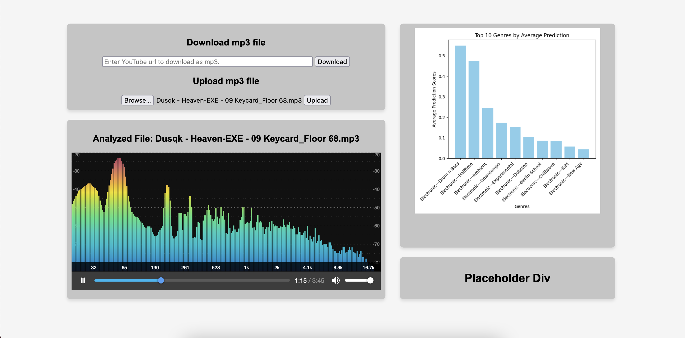

Museko is an online music analysis tool. 

- Genre classification with Essentia TensorFlow models (discogs EffNet CNN, genre_discogs400)
- YouTube mp3 downloader (Python: yt-dl, Flask)
- Real-time audio visualizer (JavaScript: audioMotion-analyzer)
- (TODO) BPM and additional song details (Python: librosa)

